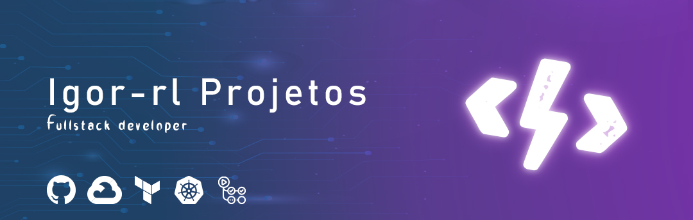

# FullCycle Imersão 16 - Desafio 2 - Nest.js com Docker

## Iniciar a aplicação

```
docker compose up
```

## Detalhes do desafio
"Neste desafio, você deve criar uma aplicação Nest.js com Docker que rode na porta 3000.

Esta aplicação precisa expor 2 rotas de API Rest:
- Listar assets - POST /api/assets
- Criar assets - GET /api/assets
- Criar orders - POST /api/orders
- Listar orders - GET /api/orders

Um asset tem os seguintes dados:
- id (é informado pelo usuário)
- symbol (símbolo do ativo)

Uma order tem os seguintes dados:
- id automático do banco
- asset_id (relacionado com Asset)
- price
- status (open, pending, closed) (não pode deixar mandar o status no POST)

O ORM a ser usado é o Prisma ORM e o banco de dados precisa ser o Mongo, image: bitnami/mongodb:5.0.17
Crie o arquivo api.http para fazer as chamadas HTTP. Ao rodar o docker compose up já precisa subir logo de cara o projeto com o Nest.js rodando + o MongoDB."


##

<div align="center">

[](https://github.com/igor-rl) 


</div>